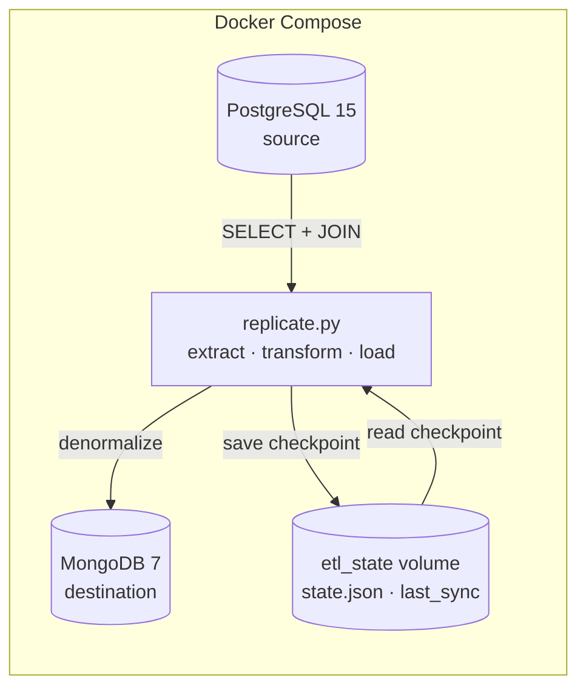
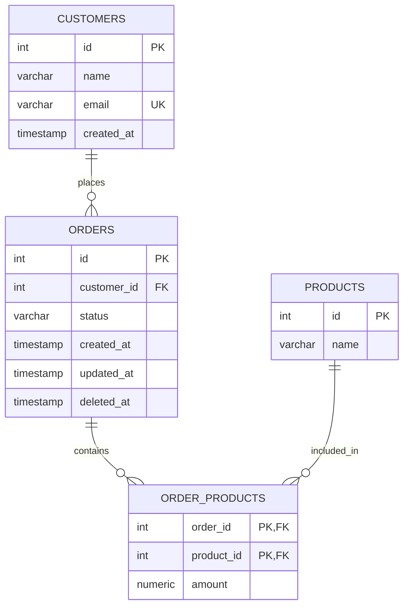
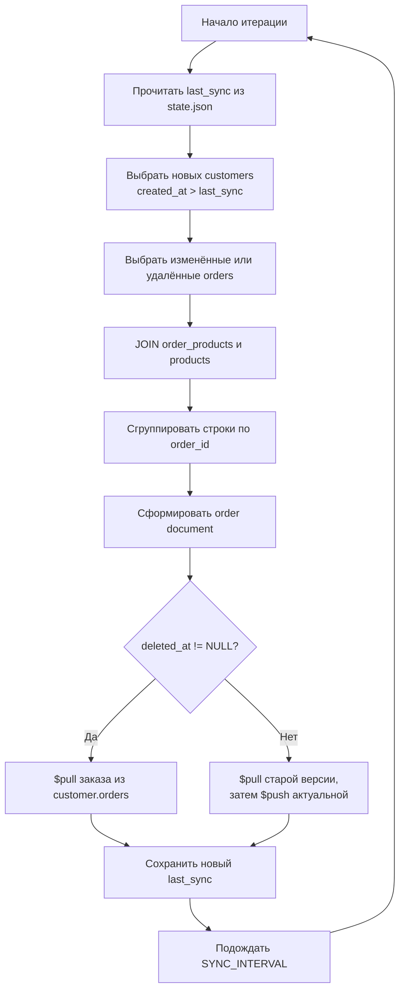

# PostgreSQL → MongoDB ETL Pipeline

**Стек:** Python · PostgreSQL 15 · MongoDB 7 · psycopg2 · PyMongo · Docker Compose

Python-сервис периодически переносит новые и изменённые данные из нормализованной PostgreSQL в денормализованную коллекцию MongoDB. Проект показывает полный ETL-цикл: выборку данных через SQL, преобразование реляционных связей в документную структуру и incremental-синхронизацию по timestamp с локальным checkpoint.

## Архитектура



Docker Compose поднимает PostgreSQL, MongoDB и отдельный ETL worker. Состояние сервисов сохраняется в named volumes `pg_data`, `mongo_data` и `etl_state`; схема PostgreSQL создаётся из `init.sql` при первой инициализации пустого volume. Для локальной отладки `replicate.py` также можно запустить на хосте.

## Задача

Исходные данные хранятся в нормализованной OLTP-модели PostgreSQL:

```text
Customer
  └── Orders
        └── OrderProducts
              └── Products
```

Для read-oriented сценария сервис формирует в MongoDB представление клиента, в которое вложены его заказы и товары:

```text
Customer
  └── orders[]
        └── products[]
```

Таким образом, чтение данных о клиенте и составе его заказов не требует дополнительных JOIN на стороне потребителя. Проект демонстрирует перенос и преобразование данных между SQL- и document-oriented БД, а не полноценную CDC-репликацию.

## Data model

### PostgreSQL

| Таблица | Поля | Назначение |
|---|---|---|
| `customers` | `id`, `name`, `email`, `created_at` | Клиенты |
| `orders` | `id`, `customer_id`, `status`, `created_at`, `updated_at`, `deleted_at` | Заказы и timestamps для синхронизации |
| `products` | `id`, `name` | Каталог товаров |
| `order_products` | `order_id`, `product_id`, `amount` | Связь many-to-many между заказами и товарами |



В `order_products` используется составной primary key `(order_id, product_id)`. Внешние ключи связывают заказы с клиентами, а строки состава заказа — с заказами и товарами.

## MongoDB document model

Каждый клиент хранится отдельным документом в коллекции `customers`. Пример соответствует полям, которые формирует `replicate.py`:

```json
{
  "_id": 1,
  "name": "Alexander",
  "email": "example@mail.com",
  "orders": [
    {
      "order_id": 101,
      "customer_id": 1,
      "status": "pending",
      "placed_at": "2026-03-19T18:00:00",
      "updated_at": "2026-03-19T18:05:00",
      "deleted_at": null,
      "products": [
        {
          "product_id": 1,
          "name": "Product",
          "amount": 2.0
        }
      ]
    }
  ],
  "synced_at": "2026-03-19T18:05:10"
}
```

В реальной MongoDB значения `placed_at`, `updated_at` и `synced_at` сохраняются как BSON Date, поскольку PyMongo получает объекты `datetime` из PostgreSQL. `amount` явно преобразуется в `float`.

## Как работает синхронизация



Одна итерация выполняет следующие действия:

1. Читает `last_sync` из `state.json`; если файла нет, использует `1970-01-01`.
2. Получает клиентов с `customers.created_at > last_sync`.
3. Получает изменённые заказы по `orders.updated_at > last_sync` и строки с заполненным `deleted_at`.
4. Выполняет в PostgreSQL `JOIN orders → order_products → products`.
5. Группирует результат по `order_id`.
6. Формирует в Python денормализованный документ заказа с массивом `products`.
7. Создаёт новых клиентов в MongoDB через `update_one(..., upsert=True)` и `$setOnInsert`.
8. Обновляет активные заказы либо удаляет soft-deleted заказы из `customer.orders`.
9. После успешной итерации записывает новый UTC timestamp в `state.json`.
10. Ждёт `SYNC_INTERVAL` секунд и запускает следующую итерацию.

Исключение внутри итерации выводится в stdout в формате `ERROR: <сообщение>`. Основной цикл не завершается и повторяет попытку после очередного интервала.

## Incremental synchronization

Сервис не перечитывает все данные на каждой итерации. Граница выборки хранится в `state.json`:

```json
{
  "last_sync": "2026-03-19T18:05:10.123456"
}
```

Для отбора используются:

- `customers.created_at > last_sync` — новые клиенты;
- `orders.updated_at > last_sync` — новые и изменённые заказы;
- `orders.deleted_at IS NOT NULL` — переход в ветку удаления из MongoDB;
- `state.json` — checkpoint между итерациями и перезапусками процесса; путь задаётся через `STATE_FILE`.

В `init.sql` созданы индексы:

- `idx_customers_created` по `customers(created_at)`;
- `idx_orders_updated` по `orders(updated_at)`.

Они соответствуют timestamp-предикатам incremental-выборок. Это polling по timestamp, а не log-based CDC: сервис периодически выполняет SQL-запросы и не читает журнал транзакций PostgreSQL.

Текущий SQL использует условие `o.updated_at > last_sync OR o.deleted_at IS NOT NULL`. Поэтому все ранее soft-deleted заказы повторно попадают в выборку на следующих итерациях; повторный `$pull` безопасно оставляет MongoDB без такого заказа.

## Soft Delete

Удаление заказа представлено timestamp в PostgreSQL и удалением вложенного элемента в MongoDB:

```text
PostgreSQL: orders.deleted_at != NULL
                    │
                    ▼
MongoDB: $pull из customer.orders по order_id
```

Физическая строка заказа остаётся в PostgreSQL, но перестаёт присутствовать в read-модели клиента. Это сохраняет историю в source database и не оставляет удалённый заказ в денормализованном представлении.

## Idempotency / обновление заказа

При обработке изменённого активного заказа сервис выполняет две отдельные операции:

1. удаляет прежнюю версию из массива `orders` через `$pull` по `order_id`;
2. добавляет актуальный документ через `$push`.

Такой подход предотвращает накопление нескольких версий одного заказа при повторной обработке. При этом операции не объединены в транзакцию, поэтому это не является полной транзакционной гарантией идемпотентности: сбой между `$pull` и `$push` может временно оставить документ клиента без заказа.

## Стек

| Технология | Роль |
|---|---|
| Python | ETL logic и периодический worker |
| PostgreSQL 15 | Source OLTP database |
| MongoDB 7 | Destination document database |
| psycopg2 | PostgreSQL client |
| PyMongo | MongoDB client |
| python-dotenv | Загрузка конфигурации из `.env` |
| Docker Compose | Локальная инфраструктура БД и запуск ETL worker |

## Структура проекта

```text
etl/
├── docker-compose.yml   # PostgreSQL, MongoDB, ETL worker и volumes
├── Dockerfile           # образ ETL worker
├── init.sql             # схема PostgreSQL и индексы
├── replicate.py         # ETL worker
├── requirements.txt     # зафиксированные Python-зависимости
├── .env.example         # шаблон локальной конфигурации
├── .env                 # локальная конфигурация, игнорируется Git
├── state.json           # checkpoint при host-запуске, игнорируется Git
├── .gitignore           # локальные и runtime-файлы
├── .dockerignore        # минимальный и безопасный build context
└── README.md            # документация проекта
```

`.env` содержит локальные параметры подключения и создаётся из `.env.example`. При запуске через Compose checkpoint хранится в `etl_state`, при запуске на хосте — в локальном `state.json`. Оба локальных файла исключены через `.gitignore`.

## Конфигурация

`replicate.py` читает следующие environment variables:

| Переменная | Обязательность | Назначение |
|---|---|---|
| `POSTGRES_HOST` | обязательна | Хост PostgreSQL |
| `POSTGRES_PORT` | обязательна | Порт PostgreSQL |
| `POSTGRES_DB` | обязательна | Имя базы PostgreSQL |
| `POSTGRES_USER` | обязательна | Пользователь PostgreSQL |
| `POSTGRES_PASSWORD` | обязательна | Пароль PostgreSQL |
| `MONGO_URI` | обязательна | URI подключения к MongoDB |
| `MONGO_DB` | обязательна | Имя базы MongoDB |
| `SYNC_INTERVAL` | нет | Интервал между итерациями в секундах; по умолчанию `300` |
| `STATE_FILE` | нет | Путь к checkpoint; по умолчанию `state.json` |

Файл `.env.example` содержит безопасный шаблон локальной конфигурации:

```dotenv
POSTGRES_HOST=localhost
POSTGRES_PORT=5432
POSTGRES_DB=etl_source
POSTGRES_USER=etl_user
POSTGRES_PASSWORD=change_me
MONGO_URI=mongodb://localhost:27017
MONGO_DB=etl_destination
SYNC_INTERVAL=300
```

Значения приведены только как нейтральный пример. Реальные credentials не следует добавлять в Git.

## Запуск

### 1. Подготовить конфигурацию

Скопируйте `.env.example` в `.env` и при необходимости измените значения.

### 2. Запустить весь pipeline

```bash
docker compose up -d --build
```

Команда запускает обе БД и ETL worker. Compose подставляет worker внутренние адреса сервисов, ожидает успешных healthchecks и хранит checkpoint в `etl_state`. PostgreSQL доступен на хосте через порт из `POSTGRES_PORT`, MongoDB — через `27017`. `init.sql` автоматически выполняется только при первой инициализации пустого `pg_data`.

### 3. Локальный запуск worker

Для отладки можно запустить только базы данных:

```bash
docker compose up -d postgres mongodb
```

Затем создать virtual environment:

```bash
python -m venv .venv
```

После активации environment командой для своей ОС установить зафиксированные зависимости:

```bash
python -m pip install -r requirements.txt
```

После этого worker запускается командой:

```bash
python replicate.py
```

Процесс выполняет синхронизацию сразу после запуска, затем повторяет её через `SYNC_INTERVAL` секунд. Остановить worker можно через `Ctrl+C`.

## Пример вывода

```text
[2026-03-19T18:05:10.123456] synced 2 customers, 5 orders
```

Число заказов соответствует количеству сгруппированных `order_id`, обработанных в итерации, включая попавшие в выборку soft-deleted заказы.

## Что демонстрирует проект

- проектирование небольшого ETL pipeline;
- одновременную работу с реляционной и документной моделями данных;
- transformation и denormalization связанных SQL-данных;
- incremental synchronization по timestamp и checkpoint;
- обработку soft delete в денормализованной read-модели;
- SQL JOIN и группировку результата в Python;
- использование индексов для полей incremental-выборки;
- локальную инфраструктуру PostgreSQL и MongoDB через Docker Compose;
- конфигурацию соединений через environment variables.

## Ограничения текущей реализации

- checkpoint хранится в одном `state.json` и привязан к одному экземпляру worker;
- нет общей транзакционной границы между чтением PostgreSQL, изменениями MongoDB и записью checkpoint;
- timestamp checkpoint вычисляется после обработки, поэтому изменения, произошедшие между SQL-выборкой и сохранением checkpoint, требуют более строгой стратегии границ для гарантированного захвата;
- нет batching: PostgreSQL-результаты загружаются через `fetchall()`, а MongoDB обновляется отдельными `update_one`;
- используются `INNER JOIN`, поэтому заказы без строк в `order_products` не попадают в обработку;
- изменения `name` и `email` существующего клиента не синхронизируются: выборка клиентов опирается только на `created_at`, а запись использует `$setOnInsert`;
- нет retry/reconnect для подключений к PostgreSQL и MongoDB;
- ошибки и прогресс выводятся через `print`, без structured logging;
- нет metrics и monitoring;
- нет automated tests;
- используется polling вместо CDC или event-driven replication;
- повторные подключения внутри долгоживущего процесса не реализованы; Compose перезапускает контейнер только при завершении процесса.

## Возможные улучшения

- перейти на structured logging;
- добавить retry с exponential backoff и восстановление соединений;
- обрабатывать данные batches и использовать `bulk_write` в MongoDB;
- применять PostgreSQL server-side cursors для больших выборок;
- хранить checkpoint в БД и формализовать атомарную стратегию его продвижения;
- добавить unit- и integration-тесты для transform, повторной обработки и soft delete;
- экспортировать Prometheus metrics;
- расширить graceful shutdown явным закрытием cursor текущей итерации;
- при необходимости перейти к CDC через Debezium и Kafka;
- при усложнении workflow рассмотреть Airflow, Dagster или Prefect как внешний orchestrator.

Последние два пункта — направления развития, а не технологии, уже используемые в проекте.
